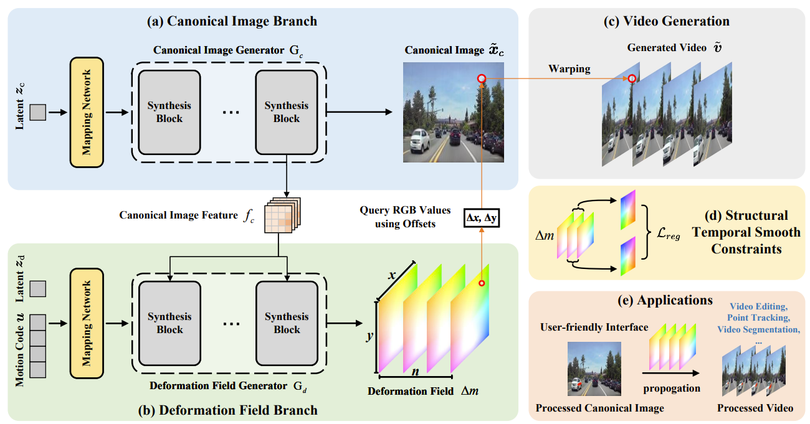
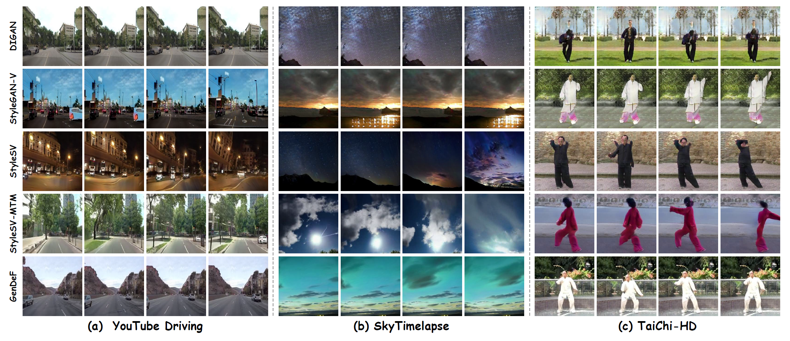
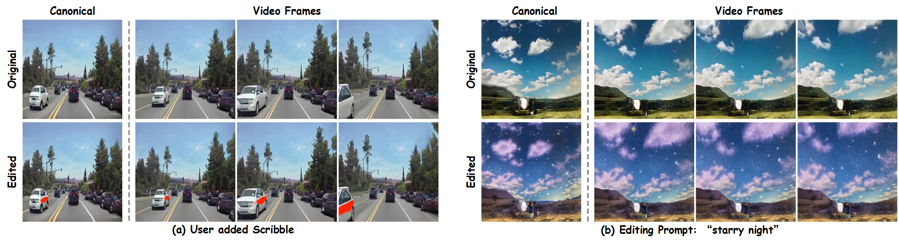
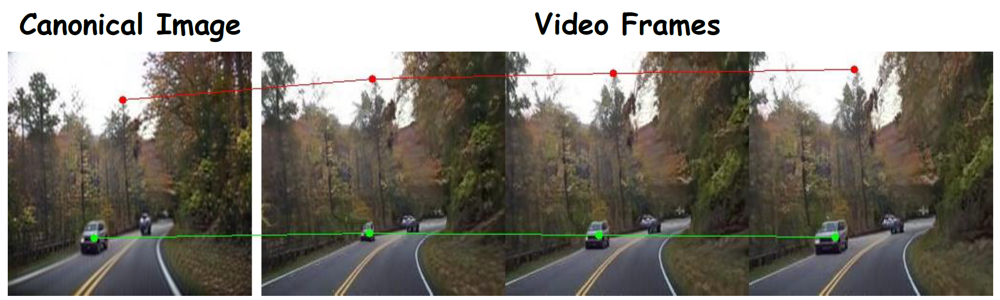
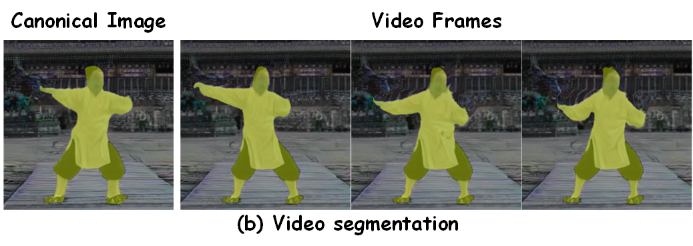
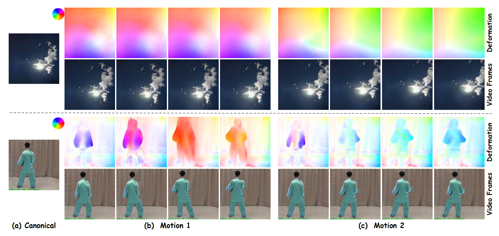

<div align="center">
<h2>GenDeF: Learning Generative Deformation Field for Video Generation</h2>

[Wen Wang](https://github.com/encounter1997)<sup>1,2*</sup> &nbsp;
[Kecheng Zheng](https://zkcys001.github.io/)<sup>2</sup> &nbsp;
[Qiuyu Wang](https://github.com/qiuyu96)<sup>2</sup> &nbsp;
[Hao Chen](https://scholar.google.com/citations?user=FaOqRpcAAAAJ)<sup>1&dagger;</sup> &nbsp;
[Zifan Shi](https://vivianszf.github.io/)<sup>3,2*</sup> &nbsp;
[Ceyuan Yang](https://ceyuan.me/)<sup>4</sup> <br>
[Yujun Shen](https://shenyujun.github.io/)<sup>2&dagger;</sup> &nbsp;
[Chunhua Shen](https://cshen.github.io/)<sup>1</sup>

<sup>*</sup>Intern at Ant Group &nbsp;
<sup>&dagger;</sup>Corresponding Author

<sup>1</sup>Zhejiang University &nbsp;
<sup>2</sup>Ant Group &nbsp;
<sup>3</sup>HKUST &nbsp;
<sup>4</sup>Shanghai Artificial Intellgence Laboratory

<p align="center">
  <a href="https://arxiv.org/abs/2312.04561">
  </a>
  <a href="https://aim-uofa.github.io/GenDeF/">
  </a>
</p>
</div>


<p align="center">
  
</p>


We offer a new perspective on approaching the task of video generation. Instead of directly synthesizing a sequence of frames, we propose to render a video by warping one static image with a generative deformation field (GenDeF). Such a pipeline enjoys three appealing advantages. First, we can sufficiently reuse a well-trained image generator to synthesize the static image (also called canonical image), alleviating the difficulty in producing a video and thereby resulting in better visual quality. Second, we can easily convert a deformation field to optical flows, making it possible to apply explicit structural regularizations for motion modeling, leading to temporally consistent results. Third, the disentanglement between content and motion allows users to process a synthesized video through processing its corresponding static image without any tuning, facilitating many applications like video editing, keypoint tracking, and video segmentation. Both qualitative and quantitative results on three common video generation benchmarks demonstrate the superiority of our GenDeF method.


## Getting Started

### Prerequisites

- Python 3.8+
- CUDA 11.3+
- PyTorch 1.11+ and torchvision 0.12+

### Installation

```bash
# Clone the repository
git clone https://github.com/aim-uofa/GenDeF.git
cd GenDeF

# Install PyTorch (adjust for your CUDA version, see https://pytorch.org/)
pip install torch==1.11.0+cu113 torchvision==0.12.0+cu113 --extra-index-url https://download.pytorch.org/whl/cu113

# Install Python dependencies
pip install -r requirements.txt

# Install the project in editable mode
pip install -e .
```


## Dataset Preparation

We support training on the following video datasets:
- **YouTube Driving (YTB)**: YouTube driving videos at 256×256 resolution
- **SkyTimelapse**: Sky timelapse videos at 256×256 resolution
- **TaiChi-HD**: Tai Chi videos at 256×256 resolution

Organize the dataset as a zip archive and place it in the `data/` directory:
```
data/
  ytb_256.zip       # YouTube Driving dataset
  sky_256.zip       # SkyTimelapse dataset (optional)
  taichi_256.zip    # TaiChi-HD dataset (optional)
```

Each zip file should contain video frames organized as described in the [StyleGAN-V](https://github.com/universome/stylegan-v) dataset format.


## Training

Training follows a **two-stage** pipeline. Below we use the **TaiChi-HD** dataset as an example.

### Stage 1: Pretrain (Image Generation)

In this stage, we train a 2D image generator backbone with deformable convolutions. The model learns to generate single frames (i.e., `num_frames_per_video=1`), building a strong image generation foundation.

```bash
bash scripts/train_taichi_stage1_pretrain.sh
```

<details>
<summary>Key hyperparameters for Stage 1</summary>

| Parameter | Value | Description |
|-----------|-------|-------------|
| `sampling.num_frames_per_video` | 1 | Single-frame training |
| `model.generator.fmaps` | 0.5 | Generator feature map multiplier |
| `model.discriminator.fmaps` | 0.5 | Discriminator feature map multiplier |
| `model.generator.dcn` | true | Enable deformable convolution in generator |
| `model.discriminator.tsm` | false | Disable temporal shift module in discriminator |
| `model.loss_kwargs.r1_gamma` | 0.5 | R1 regularization weight |
| `model.generator.learnable_motion_mask` | false | Disable learnable motion mask |
| `model.generator.time_enc.min_period_len` | 16 | Minimum period length for time encoding |
| `training.aug` | ada | Adaptive augmentation |
| `training.batch_size` | 64 | Total batch size |
| `num_gpus` | 8 | Number of GPUs |

</details>

### Stage 2: Finetune (Video Generation with Deformation Field)

In this stage, we introduce the **canonical image generation** and **deformation field prediction** modules. The model learns to generate videos by warping a canonical image with a predicted deformation field. The pretrained checkpoint from Stage 1 is used as initialization.

```bash
bash scripts/train_taichi_stage2_finetune.sh
```

<details>
<summary>Key hyperparameters for Stage 2</summary>

| Parameter | Value | Description |
|-----------|-------|-------------|
| `sampling.num_frames_per_video` | 3 | Multi-frame training |
| `model.generator.fmaps` | 0.5 | Generator feature map multiplier |
| `model.discriminator.fmaps` | 0.5 | Discriminator feature map multiplier |
| `model.discriminator.tsm` | true | Enable temporal shift module |
| `model.loss_kwargs.r1_gamma` | 8 | R1 regularization weight (increased) |
| `model.generator.with_canonical` | true | Enable canonical image generation |
| `model.generator.canonical_cond` | concat | Canonical conditioning method |
| `model.generator.canonical_cond_dim` | 64 | Canonical conditioning dimension |
| `model.generator.canonical_feat` | L13_256_64 | Feature level for canonical image |
| `model.generator.deform_dcn` | true | Enable DCN for deformation prediction |
| `model.generator.deform_dcn_min_res` | 4 | Min resolution for deform DCN |
| `model.generator.deform_dcn_max_res` | 64 | Max resolution for deform DCN |
| `model.generator.deform_dcn_torgb` | true | Enable DCN for toRGB layers |
| `training.resume` | Stage 1 ckpt | Resume from Stage 1 pretrained model |

</details>

### Key Differences between Stage 1 and Stage 2

| Aspect | Stage 1 (Pretrain) | Stage 2 (Finetune) |
|--------|-------------------|---------------------|
| **Frames per video** | 1 (image-only) | 3 (video) |
| **Temporal modeling** | Disabled (`tsm=false`) | Enabled (`tsm=true`) |
| **Canonical image** | Not used | Enabled |
| **Deformation field** | Not used | Enabled with DCN |
| **R1 gamma** | 0.5 | 8.0 |
| **Learnable motion mask** | false | true |


## Generation (Sampling)

After training, generate videos using:

```bash
bash scripts/generate_videos.sh
```

You can customize the generation by editing the script or passing arguments directly:

```bash
python src/scripts/generate_ours.py \
    --network_pkl output/taichi_finetune/output/best.pkl \
    --num_videos 100 \
    --save_as_mp4 true \
    --fps 25 \
    --video_len 128 \
    --batch_size 25 \
    --outdir sample/taichi \
    --truncation_psi 0.9 \
    --seed 42
```

| Argument | Description |
|----------|-------------|
| `--network_pkl` | Path to the trained model checkpoint (`.pkl`) |
| `--num_videos` | Number of videos to generate |
| `--video_len` | Number of frames per video |
| `--fps` | Frames per second for saved mp4 |
| `--truncation_psi` | Truncation (lower = higher quality, less diversity) |
| `--save_as_mp4` | Save as mp4 video files |
| `--seed` | Random seed for reproducibility |


## Main Results

<p align="center">
  
</p>


## Applications

### Video Editing
<p align="center">
  
</p>


### Point Tracking
<p align="center">
  
</p>


### Video Segmentation
<p align="center">
  
</p>

### Diverse Motion Generation
<p align="center">
  
</p>


## Acknowledgements

This codebase is built on top of [StyleGAN-V](https://github.com/universome/stylegan-v). We thank the authors for their excellent work.


## Citing

If you find our work useful, please consider citing:


```BibTeX
@misc{wang2023gendef,
    title={GenDeF: Learning Generative Deformation Field for Video Generation},
    author={Wen Wang and Kecheng Zheng and Qiuyu Wang and Hao Chen and Zifan Shi and Ceyuan Yang and Yujun Shen and Chunhua Shen},
    year={2023},
    eprint={2312.04561},
    archivePrefix={arXiv},
    primaryClass={cs.CV}
}
```
