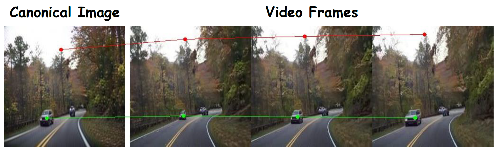

<div align="center">
<h2>GenDeF: Learning Generative Deformation Field for Video Generation</h2>

[Wen Wang](https://github.com/encounter1997)<sup>1,2*</sup> &nbsp;
[Kecheng Zheng](https://zkcys001.github.io/)<sup>2</sup> &nbsp;
[Qiuyu Wang](https://github.com/qiuyu96)<sup>2</sup> &nbsp;
[Hao Chen](https://scholar.google.com/citations?user=FaOqRpcAAAAJ)<sup>1&dagger;</sup> &nbsp;
[Zifan Shi](https://vivianszf.github.io/)<sup>3,2*</sup> &nbsp;
[Ceyuan Yang](https://ceyuan.me/)<sup>4</sup> <br>
[Yujun Shen](https://shenyujun.github.io/)<sup>2&dagger;</sup> &nbsp;
[Chunhua Shen](https://cshen.github.io/)<sup>1</sup>

<sup>*</sup>Intern at Ant Group &nbsp;
<sup>&dagger;</sup>Corresponding Author

<sup>1</sup>Zhejiang University &nbsp;
<sup>2</sup>Ant Group &nbsp;
<sup>3</sup>HKUST &nbsp;
<sup>4</sup>Shanghai Artificial Intellgence Laboratory

<p align="center">
  <a href="https://arxiv.org/abs/2312.04561">
  </a>
  <a href="https://aim-uofa.github.io/GenDeF/">
  </a>
</p>
</div>


<p align="center"><b>Code will be released soon!</b></p>

<p align="center">
  
</p>


We offer a new perspective on approaching the task of video generation. Instead of directly synthesizing a sequence of frames, we propose to render a video by warping one static image with a generative deformation field (GenDeF). Such a pipeline enjoys three appealing advantages. First, we can sufficiently reuse a well-trained image generator to synthesize the static image (also called canonical image), alleviating the difficulty in producing a video and thereby resulting in better visual quality. Second, we can easily convert a deformation field to optical flows, making it possible to apply explicit structural regularizations for motion modeling, leading to temporally consistent results. Third, the disentanglement between content and motion allows users to process a synthesized video through processing its corresponding static image without any tuning, facilitating many applications like video editing, keypoint tracking, and video segmentation. Both qualitative and quantitative results on three common video generation benchmarks demonstrate the superiority of our GenDeF method.

## Main Results

<p align="center">
  
</p>


## Applications

### Video Editing
<p align="center">
  
</p>


### Point Tracking
<p align="center">
  
</p>


### Video Segmentation
<p align="center">
  
</p>

### Diverse Motion Generation
<p align="center">
  
</p>


## Citing
If you find our work useful, please consider citing:


```BibTeX
@misc{wang2023gendef,
    title={GenDeF: Learning Generative Deformation Field for Video Generation},
    author={Wen Wang and Kecheng Zheng and Qiuyu Wang and Hao Chen and Zifan Shi and Ceyuan Yang and Yujun Shen and Chunhua Shen},
    year={2023},
    eprint={2312.04561},
    archivePrefix={arXiv},
    primaryClass={cs.CV}
}
```
